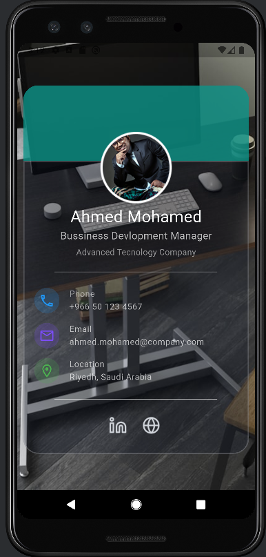

# Flutter Profile Card

This is my **first executable project using Flutter**!  
I am currently learning Flutter, and this project marks my first hands-on attempt at building a functional app.

## Project Overview

The app is a **profile card** that presents user information in a clean and visually appealing layout.  
It leverages **Stack, Positioned, and Container widgets** to create a layered interface with background images, profile picture, and information cards.

### Features

- Responsive layout with `Stack` and `Positioned`.
- Semi-transparent cards with customized colors using `Color.fromRGBO`.
- Rounded profile picture.
- Contact information with icons: phone, email, and location.
- Social media links with interactive-looking icons (UI only).

### Technologies Used

- **Flutter & Dart**
- Core widgets: `Stack`, `Container`, `Positioned`, `ListTile`, `Divider`, `Text`, `Image`.
- Styling: `BoxDecoration`, `BorderRadius`, `Colors` with opacity.

## Preview

| Figma Design | My Flutter implementation |
|:------------:|:-----------------:|
|  |  |

